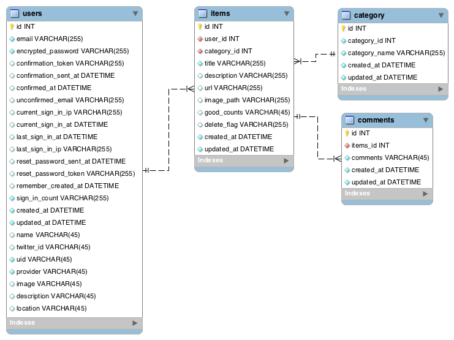

# i-made-this
わたしが作ったものを見て！自慢できるSNS

## 基本コミュニケーション

- Slack
  - チャット
- Discord,ハングアウト
  - 通話
- trello
  - 開発管理
- figma
  - デザイン

## ブランチ運用方法

| Branch | Rule |
|:-:|:-:|
| master | 直接pushしないこと |
| develop | 開発ブランチ |
| {作業名} | 作業ブランチ |

developブランチから作業名のブランチを切ってdevelopへマージしてください、
必ずレビューが必要です。

※ 例えばtopのスタイル修正なら `fix-top_page-style` のように切る

## Versions

### Local

| Name | Version |
|:-:|:-:|
| Ruby | 2.5.1 |
| Rails | 5.2.0 |
| MySQL | 8.0.11 |

### Production

| Name | Version |
|:-:|:-:|
| Ruby | 2.5.1 |
| Rails | 5.2.0 |
| cleardb:ignite | 5.5.56 |

## data design



## ローカル環境の立て方(初回)

### imagemagic

```
$ brew install imagemagick
```

### ruby のバージョンを確認する

合っていれば次へ

合っていなければrbenv等でインストールしてください

```
$ ruby -v
=> 2.5.1
```

### mysql のバージョンを確認する

5.5.6にいずれ合わせようかなーと思っている

MySQLローカルに入れたくないよって方は藁谷まで(Dockerの環境を構築します)

```
$ mysql --version
=> 8.0.11
```

### bundle Install

```
$ ./dev-tools/bundle-install.sh

もしくは

$ bundle install --path vendor/bundle
```

### env設定

以下を `direnv` とか `.env` でいい感じに `export` してあげてください

.env.exampleがサンプルファイルとなる為 `cp .env.example .env` とかでも

```
# 必須項目 基本設定

## mysqlユーザー名
export MYSQL_USERNAME=root

## mysqlパスワード
export MYSQL_PASSWORD=

## mysqlのホスト(127.0.0.1 や localhost)
export MYSQL_HOST=localhost

## webのポート番号(http://localhost:2000)
## 2000じゃないとTwitterAuthにてコールバックできません
## 2000以外を使いたい人は言ってください。追加します。
export WEB_PORT=2000

## ファイルアップにAWSを利用するか(true/false)
## falseの場合はローカルに保存されます
## trueの場合は AWS 設定(任意) を入力してください
export FOG_USE=false

## twitter認証系
export TWITTER_API_KEY=
export TWITTER_SECRET_KEY=

# AWS 設定(任意)
export FOG_PROVIDER=
export FOG_ACCESS_KEY=
export FOG_SECRET_ACCESS_KEY=
export FOG_REGION=
export FOG_S3_BUCKET_NAME=
export FOG_S3_URL=https://s3....
```

### db設定

```
$ ./dev-tools/reset-database.sh

もしくは

$ bundle exec rake db:create
$ bundle exec rake db:migrate
$ bundle exec rake db:seed
$ bundle exec rake db:create RAILS_ENV=test
$ bundle exec rake db:migrate RAILS_ENV=test
$ bundle exec rake db:seed:category RAILS_ENV=test

```

### サーバーを立てる

```
$ ./dev-tools/start-rails-server.sh

もしくは

$ bundle exec rails s -b 0.0.0.0 -p $WEB_PORT
```

http://127.0.0.1:{port番号}

## Heroku App先

リダイレクト元：https://i-made-this.app/

リダイレクト先：http://i-made-this-app.herokuapp.com/
